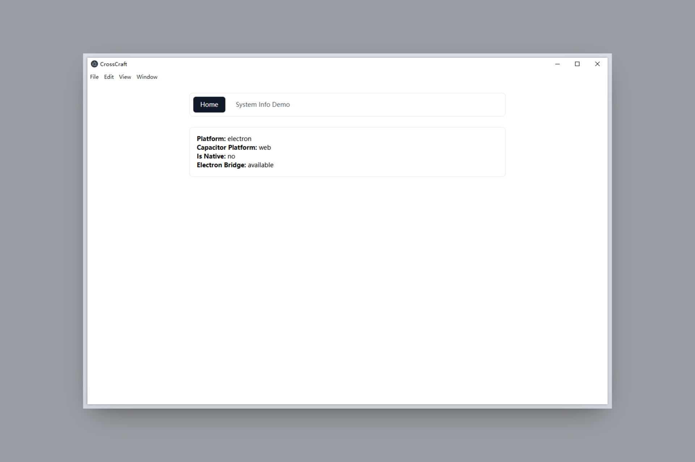
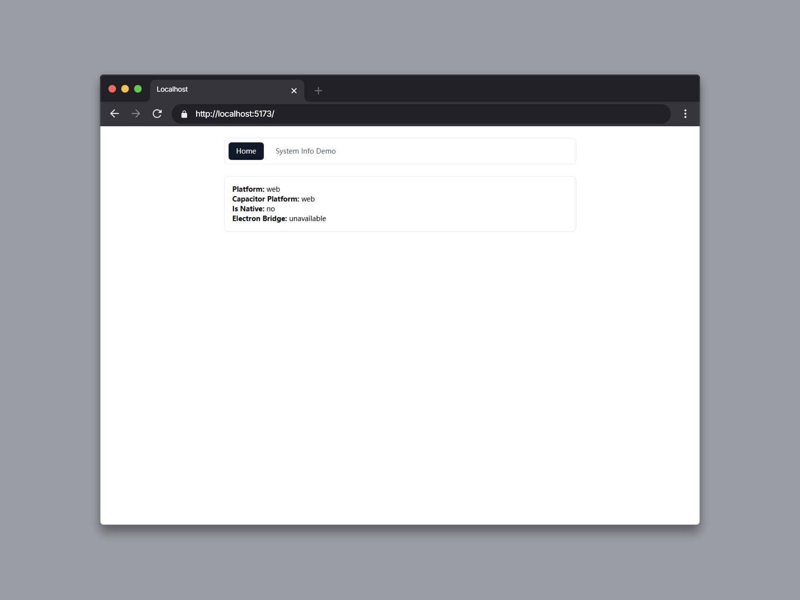
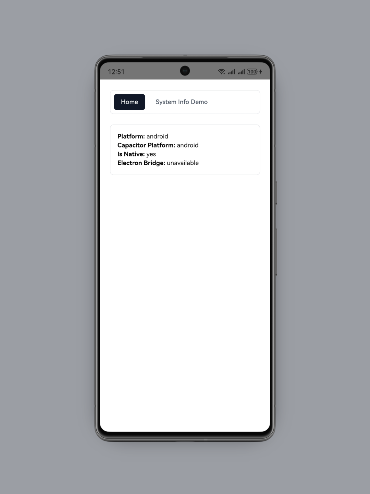

# cross-craft

> ⚒️ A cross-platform starter (Web + Capacitor + Electron) built on a Vite+ monorepo for team-ready engineering workflows.

[简体中文 README](./README.md)

## ✨ Features

- ⚡️ **Vite+ Monorepo** — Unified workspace for Web / Electron / Mobile apps and shared packages
- 📱 **One Codebase, Multi-Platform Builds** — Build and package for Web / Desktop / Mobile
- 🔋 **TypeScript First** — End-to-end type-safe bridge protocol, method inputs, and outputs
- 🔐 **Secure Electron Baseline** — `contextIsolation` + `sandbox` with controlled preload exposure
- 🌉 **Capacitor ↔ Electron Bridge** — Built-in bridge capabilities (`runtime` / `external` / `file`)
- 🧭 **Versioned Bridge Protocol** — Unified versioning for protocol and IPC channel
- 🧪 **Built-in Validation & Tests** — Request validation, stable error codes, and core test coverage
- 🔄 **Dev-Time Hot Reload** — Coordinated hot reload and auto-restart for renderer and main process
- ⚙️ **Unified App Config** — `app.config.ts` + `sync:app-config` for cross-platform config sync

## 🧱 Preconfigured Modules

- 🎨 **Frontend**: Vue 3, Vue Router, UnoCSS, Sass
- 🖥 **Desktop**: Electron + electron-builder + integrated dev workflow
- 📱 **Mobile**: Capacitor workflow for Android/iOS/Web
- 🔌 **Shared Packages**:
  - `@cross-craft/capacitor-electron`

## 🖼️ Screenshots

<details>
<summary>Electron (Windows)</summary>



</details>

<details>
<summary>Web (Browser)</summary>



</details>

<details>
<summary>Android</summary>



</details>

## 🚀 Quick Start

> Node.js requirement: `>= 22.12.0`

```bash
vp install
```

```bash
vp run ready
```

## ⚙️ Unified App Config

Single source config: `app.config.ts`

Current synced fields:

- `appName` (web title / Electron `productName` / Android+iOS display names)
- `appVersion` (root/workspace package versions / Android `versionName` / iOS `MARKETING_VERSION`)
- `appBuildNumber` (Android `versionCode` / iOS `CURRENT_PROJECT_VERSION`)
- `apiVersion` (`@cross-craft/capacitor-electron` protocol version and channel major)

After editing config, run:

```bash
vp run sync:app-config
```

## 🧪 Common Commands

### Root

```bash
# Development
vp run dev
vp run dev:electron
vp run dev:android
vp run dev:ios

# Quality checks
vp run test
vp run lint
vp run check

# Build
vp run build
vp run sync:app-config
```

### Mobile

```bash
vp run cap
vp run mobile#sync
vp run mobile#sync:android
vp run mobile#sync:ios
```

## 🗂 Project Structure

```txt
cross-craft/
  apps/
    frontend/                         # Web app (Vue + Vite)
    electron/                         # Desktop host (Electron)
    mobile/                           # Capacitor shells (Android/iOS)
  packages/
    capacitor-electron/               # Capacitor <-> Electron bridge
    utils/                            # Shared utilities
    vite-plugin-cross-craft-electron/ # Dev workflow integration for Electron
  scripts/                            # Root-level workflow scripts
```

## 🧭 Use Cases

- 🏁 Bootstrap a cross-platform stack from scratch
- 🔄 Extend existing web projects to desktop and mobile
- 🏢 Maintain an internal reusable cross-platform starter

## 📋 Starter Checklist

- [ ] Rename app metadata and package IDs (for example, `com.yourteam.app`)
- [ ] Replace demo pages in `apps/frontend`
- [ ] Update packaging metadata in `apps/electron` (`productName`, icons, publish config)
- [ ] Align native app settings in `apps/mobile` (bundle/app IDs, splash/icons)
- [ ] Add CI, release, and team conventions
